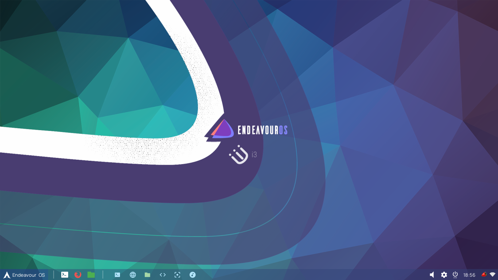
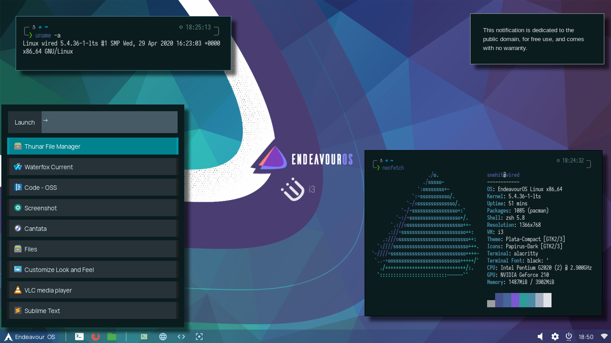
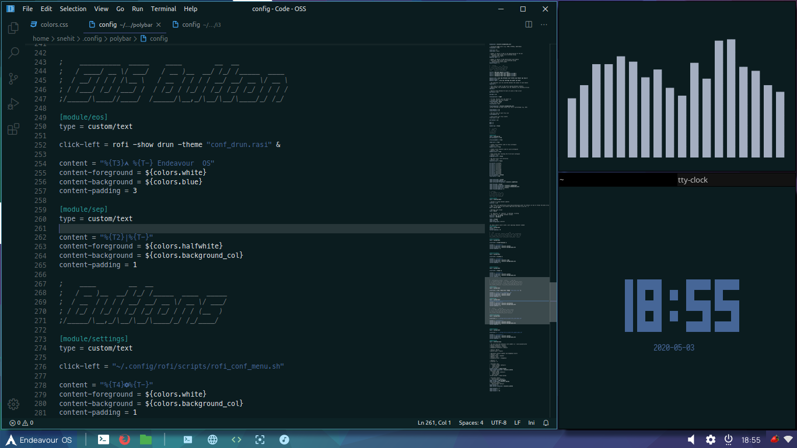

# eos-clone-i3-theme
My imagination of the i3 theme for Endeavour OS, heavily inspiring from the default Xfce theme in EOS.
**This is an UNOFFICIAL theme.**

## Screenshots






## Installation

### Get the dependencies

```
    yay -S i3-gaps polybar rofi picom dunst
```
### Install Fonts
[Anonymice Nerd Font](https://www.nerdfonts.com/font-downloads)

[Manrope](https://fonts.google.com/specimen/Manrope)

You can install any Nerd Font you want, since it is used ONLY for the icons. Anonymice has a small size, so I recommend that if you don't have any.


### Clone this repo

```
    git clone --depth 1 https://github.com/snehitsah/eos-clone-i3-theme.git
```

### Copy the files

Copy the files from .config folder of my repo to your ~/.config/ 

Of course, make backups before proceeding.

## Keybindings to Remember

My keybindings are almost same as i3. The extra ones you should remmber are:
```
mod+d : drun

mod+shift+d : run

f4 : power menu

f10 : window switcher

mod+p : start polybar

mod+shift+p : kill polybar
```

Default Mod button is Super key, or Lin key, if you call it that. But it's not called the Win key :)

Mod key can be changed by changing ModButton variable in i3 config.

## Help!

If you find any eoors in here, or have suggestions please create a post in the issues tab! Thank You!